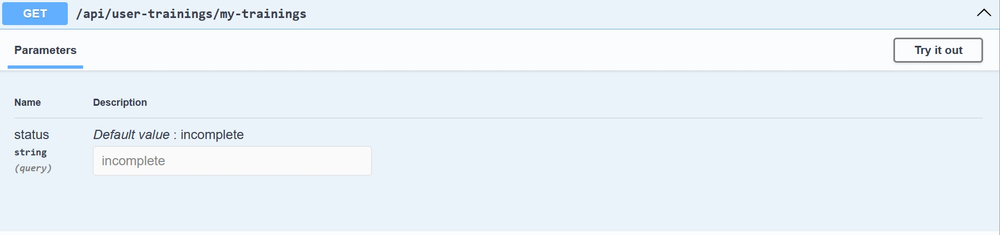
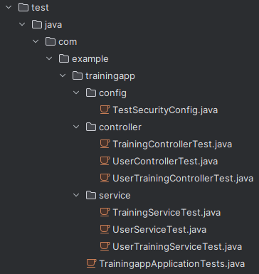
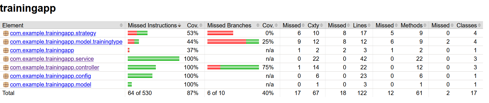
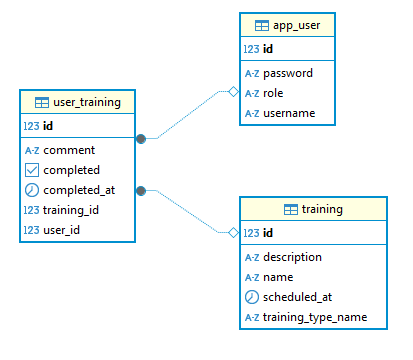

# JavaTrainingApp

## Opis projektu

JavaTrainingApp jesy aplikacją przeznaczoną dla trenerów personalnych do zarządzania usługami dla swoich klientów. Główną funkcjonalnością jest  wymiana informacji o treningach pomiędzy trenerem (użytkownik ADMIN) a klientem (użytkownik USER).

Projekt został wykonany jako praca zaliczeniowa na laboratoria z Javy na PK i dotyczy tylko części backendowej.

## Opis szczegółowy funkcjonalności
- Zarządzanie treningami
- Przypisywanie uczestników do treningów
- Monitorowania realizacji treningów przez klientów
- Obsługa 2 ról: trener (jako ADMIN) oraz klient (jako USER)
- Projekt posiada REST API

## Wykorzystane technologie
- JDK17
- Docker
- Maven
- Spring Boot 3.1
- Spring Security
- Swagger UI
- Hibernate + PostgreSQL
- Jacoco

## Architektura 
Projekt posiada następujące warstwy:
- **Controller** - odpowiada za przetwarzanie żądań HTTP
- **Service** - realizuje logikę biznesową
- **Repository** - odpowiada za dostęp do danych

## Wzorce projektowe 


### Strategy Pattern 
Zastosowany w GET /api/user-trainings/my-trainings do filtrowania listy treningów.

**strategy/TrainingFilterStrategy.java**   
Interfejs. Definiuje metodę filter, którą implementują pozostałe pliki.

**strategy/AllTrainingsStrategy.java**  
Strategia zwracająca całą listę treningów. Brak filtracji wyników.

**strategy/CompletedTrainingsStrategy.java**  
Strategia zwracająca całą listę treningów ukończonych. Filtruje na podstawie zmiennej completed == true.

**strategy/IncompleteTrainingsStrategy.java**  
Strategia zwracająca całą listę treningów oczekujących na ukończenie, czyli ze statusem completed == false.

**strategy/TrainingFilterContext.java**  
Wybiera odpowiednią strategię w zależności od parametru all/completed/incomplete. W przypadku braku podstania przez użytkownika, zwraca defaultowo "incomplete". 



### Factory Pattern
Tworzenie typów treningów, wykorzystane do ich grupowania i automatycznego dołączania opisów. 
```
TrainingService --> TrainingTypeFactory --> TrainingType --> Cardio/Strenght/Other
```
**model/TrainingType/TrainingFilterStrategy.java**   
Interfejs. Definiuje wspólny interfejs dla wzorca. 

**model/TrainingType/CardioTraining.java**  
**model/TrainingType/StrengthTraining.java**  
**model/TrainingType/OtherTraining.java**  
Konkretne implementacje dla różnych typów treningu. Każdy trening zawiera swój unikalny opis z rozbudowaną informacją o sposobie wykonania tego treningu. 

**model/TrainingType/TrainingFilterContext.java**  
Wybiera odpowiednią strategię w zależności od parametru all/completed/incomplete. W przypadku braku podstania przez użytkownika, zwraca defaultowo "incomplete". 


## System autoryzacji i bezpieczeństwo

Role są definiowane w klasie `Role` jako enum:

```java
public enum Role {
    USER, ADMIN
}
```
USER to typ użytkownika przeznaczony dla klientów, a ADMIN dla trenera. 

Bezpieczeństwo zapewnia:
- Spring Security
- BCryptPasswordEncoder
Jednak z uwagi na fakt, że jest to prosty projekt studencki oraz dla ułatwienia testowania, nie hashowałem haseł w bazie danych. Przez cały czas pracy nad projektem chciałem mieć możliwość prostej, ręcznej modyfikacji rekordów w bazie. 

## Uprawnienia użytkowników
**USER** 
- Przeglądanie swoich treningów z podziałem na:
    - do wykonania
    - zrobione
    - pełna historia treningów
- Oznaczanie treningów jako wykonanych
- Dodawanie komentarzy do wykonanych treningów

**ADMIN**
- Tworzenie, usuwanie i przeglądanie użytkowników (wszystkich oraz po ID)
- Tworzenie, usuwanie, przeglądanie treningów
- Zlecanie treningów danym użytkownikom
- Przeglądanie feedbacku od klientów

----------------------------------

## Instrukcja "quick start" - Docker
Poniższa instrukcja prezentuje uruchomienie aplikacji z wykorzystainem Dockera. Jeśli chcesz testować lokalnie - przewijaj dalej. 

### Wymagania
- Java 17+
- Docker Desktop

### Uruchomienie
```bash
git clone <repo URL>
cd trainingapp
docker-compose up --build
```

### Dostęp do aplikacji
- API: `http://localhost:8080`

Przed dodaniem innyc użytkowników, można korzystać z defaultowych danych do logowania:
Username: 'admin'
Password: 'admin'

## Instrukcja "quick start" - lokalnie
Poniższa instrukcja dotyczy uruchomienia projektu lokalnie, bez Dockera. 

### Wymagania
- Java 17+
- Maven
- PostgreSQL

### Uruchomienie
```bash
git clone <repo>
cd trainingapp
mvn clean install
mvn spring-boot:run
```
Dalszy dostęp jest analogiczny do instrukcji dla Dockera. 

----------------------------------

## Dokumentacja API

### Endpointy: Użytkownicy

```http
GET    /api/users
POST   /api/users
GET    /api/users/{id}
DELETE /api/users/{id}

```

### Endpointy: Treningi

```http
GET    /api/trainings
POST   /api/trainings
GET    /api/trainings/{id}
DELETE /api/trainings/{id}
```

### Endpointy: Użytkownicy-Treningi (czyt. plan treningowy)

```http
POST     /api/user-trainings/assign
PATCH    /api/user-trainings/complete
GET      /api/user-trainings/user/{userId}
GET      /api/user-trainings/my-trainings
```

----------------------------------

## Testy

### Używane technologie:

- JUnit 5
- Spring Boot Test
- Mockito

### Zakres testów:

- Serwisy 
- Controllery
- Warstwę integracyjną (z bazą danych)

### Struktura test/ 




### Raport pokrycia testów



## Baza danych 

### Schemat ERD bazy: 



---
Projekt wykonany jako praca zaliczeniowa na laboratoriach z przedmiotu "Programowanie w języku Java" na studiach informatycznych Politechniki Krakowskiej. 

Autor: **Bartłomiej Kot**

Licencja: **MIT**
